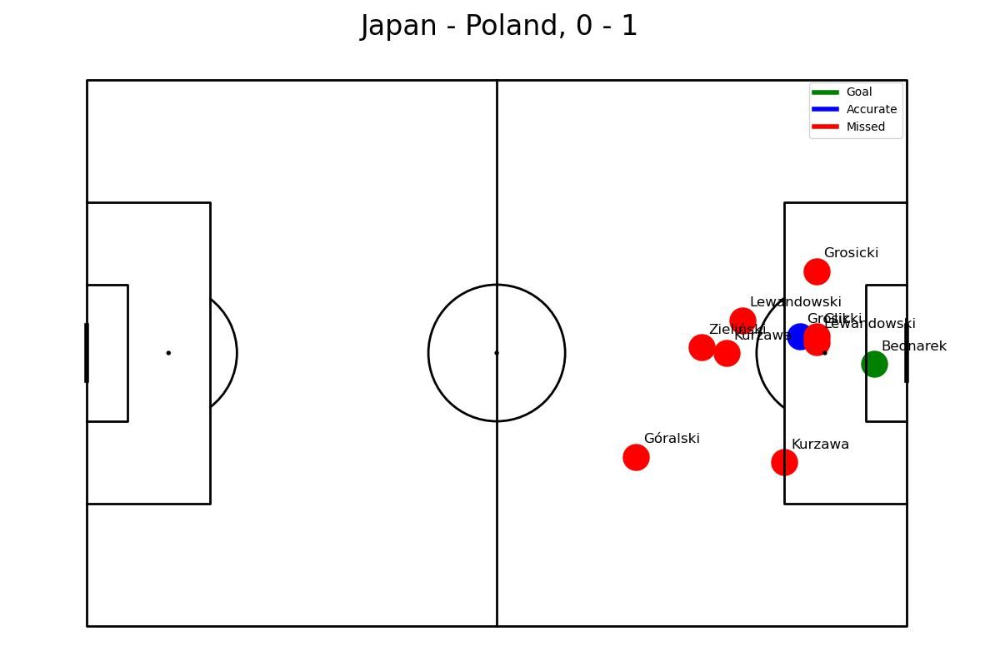
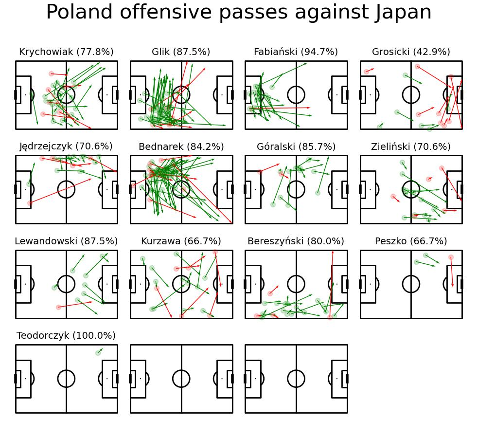
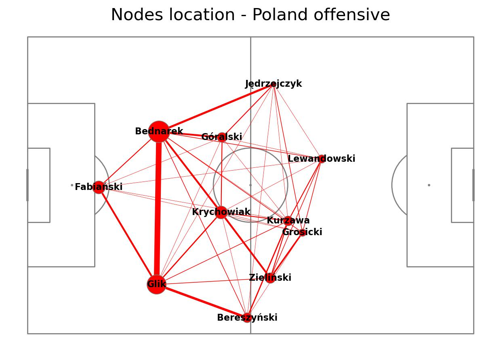
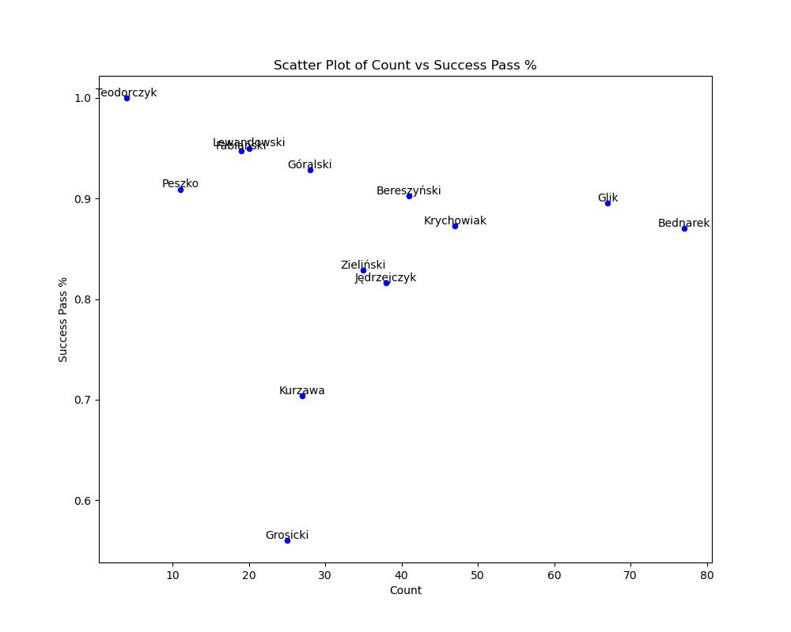

# Football Match Visualization

This project provides a comprehensive analysis and visualization of football match data, focusing on passes, shots, and player interactions. It uses data from the World Cup to create insightful visualizations that help understand team and player performance.

## Features

1. **Shot Analysis**: Visualizes shots taken by a team in a specific match, color-coded by outcome (Goal, Accurate, Missed).

   

2. **Pass Analysis**: Shows passes made by each player in the team, with arrows indicating pass direction and color indicating accuracy.

   

3. **Player Interaction Network**: Displays a network of player interactions based on successful passes.

   

4. **Pass Success Analysis**: Scatter plot showing the relationship between the number of passes attempted and pass success rate for each player.

   

5. **Centralisation Index**:  The index measures how concentrated the passes are among players, with higher values indicating that a few players make most of the passes.

## How It Works

1. **Data Loading**: The script loads match data, player information, and event data from JSON and CSV files.

2. **Team and Match Selection**: Users can specify the team and opponent for analysis. The script then filters the data for the selected match.

3. **Event Processing**: The script processes pass and shot events, standardizing coordinates and calculating relevant statistics.

4. **Visualization**: Using libraries like `mplsoccer` and `matplotlib`, the script generates various visualizations:
   - Shot map with color-coded outcomes
   - Individual player pass maps
   - Team-wide pass network
   - Pass success rate scatter plot

5. **Network Analysis**: The script calculates a centralization index to quantify how much the team's passing is centered around specific players.

## Key Insights

- The shot map provides a clear view of shot locations and outcomes, helping identify shooting patterns and efficiency.
- Individual pass maps show each player's contribution to the team's ball movement and their passing accuracy.
- The player interaction network visualizes the team's passing structure, highlighting key passers and common pass combinations.
- The pass success analysis helps identify players who balance high pass volume with good accuracy.

## Usage

1. Ensure you have the required data files in the `data/` directory.
2. Install the necessary Python libraries (pandas, matplotlib, mplsoccer, etc.).
3. Run the script, specifying the desired team and opponent.
4. Check the `figures/` directory for the generated visualizations.

## Future Improvements

- Add more match events for analysis (e.g., tackles, interceptions)
- Implement time-based analysis to show how passing patterns change throughout the match
- Create an interactive dashboard for easier data exploration

This project provides a solid foundation for in-depth football match analysis, offering valuable insights for coaches, analysts, and football enthusiasts alike.

## Sources:
Data from: Pappalardo, Luca; Massucco, Emanuele (2019). Soccer match event dataset. figshare. Collection. https://doi.org/10.6084/m9.figshare.c.4415000.v5

Visualisation guide: Maciej Gieparda